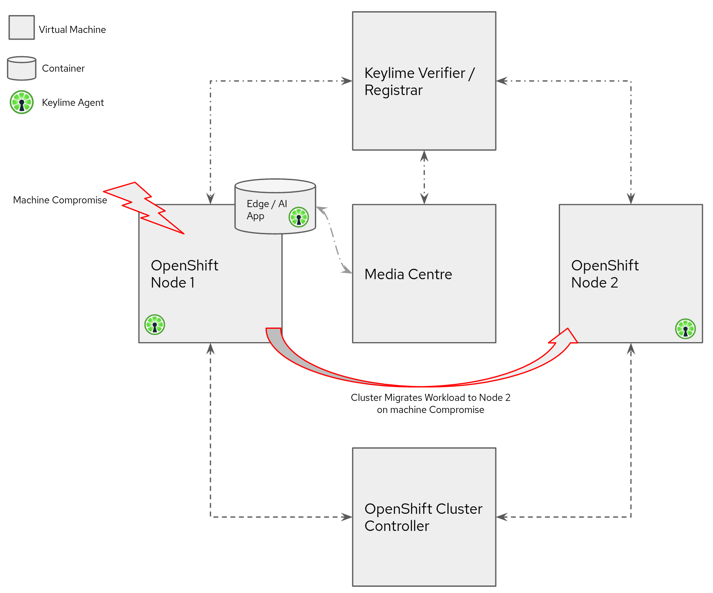

# Edge, AI & Security Demo

This repository contains the files and documentation to perform the joint Edge /
AI, Security demo developed within OCTO, Emerging Technologies.

The demo consists of an Edge / AI based application. The application streams
video content that is processed by tensorflow monitored with the streams
rendered onto a master media machine over HTTP.  

Each streaming application will be run in an OpenShift pod.

Two OpenShift nodes (virtual machine based) will be present to run the Edge AI
pod. Keylime will monitor both OpenShit nodes and all containers running in the
pod.

One of the Nodes will be compromised / hacked. When this happens, Keylime will
sense the breach. It will then inform the controller to migrate the pod to the
second node and will have all containers perform actions to blacklist the
compromised node.

The user will experience this as the video feeds continuing service while the
pod migrates to a non compromised environment.

